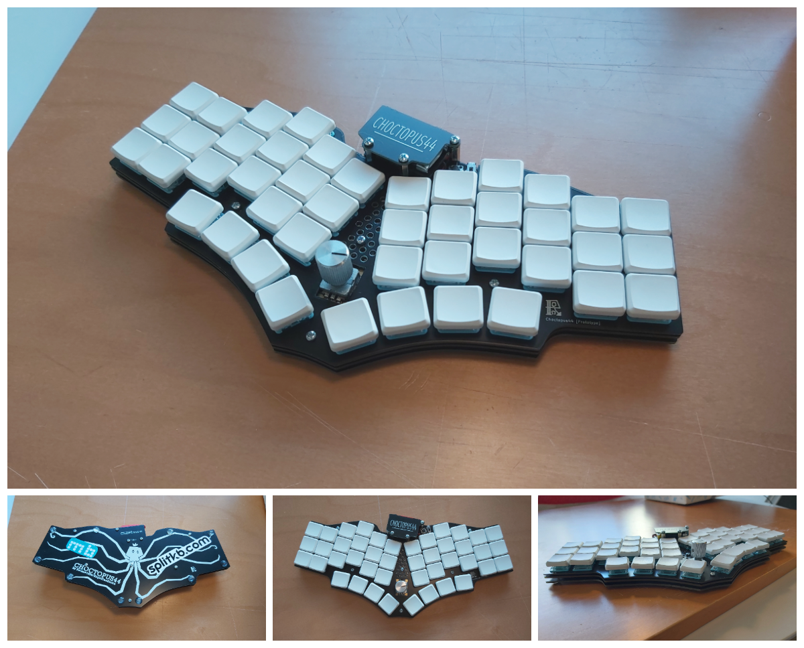

# PLEASE READ THE "KNOWN ISSUES" CHAPTER FOR IFORMATION ABOUT THE CURRENT REVISION!

# CHOCTOPUS44

The CHOCTOPUS44 is 44-key column staggered keyboard with a rotary encoder.

## Known issues

  ### Main issues

  * MCU alignment is in a poor angle, see [USB Connector Collision Diagram](images/choctopus44_usb_plug_collision.png).
  * Slide switch requires hand wiring. See [Slide Switch Handwiring Guide](documents/slide_switch_handwiring_guide.md) for documentation.
  * Switch plate does not accommodate SMD encoders properly. The side legs interfere with the encoder cut our, and it is required to clip or bend them (untested).

  ### Lesser issues

  * Choc hotswap is a little dodgy compared to MX hot swap; due to how Choc switches clip into the plate, they are not held as securely as one might hope.
  * Some case screws are very easy to over tighten thanks to the structure of the case. This might be rectifiable with different kind of plate cut outs or leaving clearance for spacers or washers.
  * Potentially flaky Bluetooth behaviour?
    * Could be a Samsung A51 specific issue? Seems to be less frequent now.
      * Could be caused by malfunctioning Nice!Nano, the unit has had a hard life
    * Can't connect to at least my Samsung Smart TV (UE55RU8005UXXC)
      * Probably caused by janky Smart TV OS
    * Very old USB devices might not be able to recognize Nice!Nano, at least my 10+ year old Toshiba has issues

## Parts list

| Part                                          | Count | Optional |
| --------------------------------------------- |:-----:|:--------:|
| PCB                                           | 1     |          |
| Top plate [PCB]                               | 1     | x        |
| Bottom plate [PCB]                            | 1     |          |
| M2 stand off 5mm                              | 6     |          |
| M2 stand off 11mm                             | 2     |          |
| M2 stand off 12mm                             | 1     |          |
| M2 screw 3mm                                  | 12    |          |
| M2 screw 8mm                                  | 3     |          |
| M2 screw 10mm                                 | 3     |          |
| Rubber feet                                   | 6-12  |          |
| Diode [1N4148 SMD or THD]                     | 45    |          |
| Kailh Choc sockets                            | 44    | x        |
| Tactile switch Omron B3F or compatible        | 1     |          |
| Slide switch C&K JS202011CQN or compatible    | 1     | x        |
| EC11 encoder                                  | 1     |          |
| ProMicro/Nice!Nano or compatible              | 1     |          |
| MCU socket (or header rows)                   | 1 (2) |          |
| Extra single pin header sockets               | 2     | x        |
| Kailh Choc key switch                         | 44    |          |
| Choc spacing compatible keycaps (e.g. MBK)    | 44    |          |
| Cable for MCU                                 | 1     |          |

### Notes

 * Single pin sockets and the slide switch only have an use case if you plan on using a Nice!Nano or equivalent as they are used for managing battery connection.
 * The length of the required stand-offs is highly dependant on the used battery and its orientation (assuming one is used at all), and the used MCU socket. With the listed screws and stand offs, a 5mm thick battery can fit between the MCU and the MCU cover without much issue as long as the the MCU socket is slim enough.
 * Using the listed slide switch requires cutting two traces and some hand wiring thanks to a mistake I made while reading datasheets. See [Slide Switch Handwiring Guide](documents/slide_switch_handwiring_guide.md) for documentation.

## Firmwares

 * QMK: https://github.com/SlightHeadache/qmk_firmware
 * ZMK (semantically incorrect WIP): https://github.com/SlightHeadache/zmk

## Build guide

See [build guide](documents/buildguide.md).
