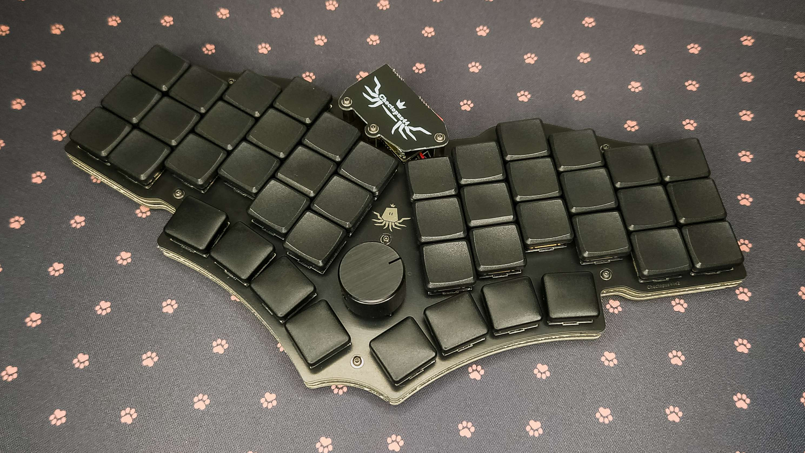

# Choctopus44

*Current version: 2.0*

Choctopus44 is low profile, Choc spaced, optionally hotswappaple 44-key column staggered keyboard with a rotary encoder.
It is loosely based on **[gtips's REVIUNG project](https://github.com/gtips/reviung)**, specifically REVIUNG41, but has deviated from it significantly during its development.




## Known issues with v2

While all the main issues of the original Choctopus44 prototypes were addressed during the development of v2, some new minor arose during it's development.

  * Switch plate does not accommodate all encoders properly. Certain non-Alps THD encoders, and SMD encoders may require filing the plate's encoder cut out to be a little bigger.
    See **[encoder documentation](documents/encoder.md)**.
  * Flaky Bluetooth behaviour in certain edge cases while using Nice!Nano, seems like certain devices don't like Nice!Nano's/ZMK's Bluetooth handling
  * During fabrication with tented vias the battery circuit vias can easily remain exposed, at least with JLCPCB. By my understanding this is caused by the solder mask liquid seeping
    into the via's hole. This doesn't seem to affect other vias as only the battery vias are slightly larger than usual. This should be avoidable by using plugged vias instead, but as
    that increases the cost of manufacturing I'm going to create a hotfix version in the future that shrinks those vias to the standard size to alleviate the issue.


## TODO

  * Add documentation for v2's plate and bottom foams


## Parts list

### Main components

| Part                                          | Count   | Optional | Notes |
| --------------------------------------------- |:-------:|:--------:|:-----:|
| PCB                                           | 1       |          |       |
| Diode [1N4148 SMD or THD]                     | 45      |          |       |
| Kailh Choc sockets                            | 44      | x        |       |
| Tactile switch TL3342 or compatible           | 1       |          | Stem height of 1.54mm used in tested builds |
| Slide switch PCM12 or compatible              | 1       | x        | Only useful if a wireless microcontroller is used in conjunction with a battery |
| EC11 encoder or compatible                    | 1       | x        | See detailed **[encoder documentation](documents/encoder.md)**; Can also be replaced with a Choc or an MX switch |
| ProMicro/Nice!Nano or compatible              | 1       |          |       |
| MCU socket (or header rows)                   | 1 (2)   | x        |       |
| Kailh Choc key switch                         | 44 (45) |          |       |
| 3.7 Volt battery                              | 1       | x        | Only useful if a wireless microcontroller is used |


### Case hardware

| Part                                          | Count   | Optional | Notes |
| --------------------------------------------- |:-------:|:--------:|:-----:|
| Top plate [PCB]                               | 1       |          |       |
| Bottom plate [PCB]                            | 1       |          |       |
| M2 stand off 5mm                              | 9       |          |       |
| M2 screw 3mm                                  | 15 (18) |          | 18 needed if MCU cover is not used |
| Rubber bump ons                               | ~11     |          | Depending on your bump ons you might need to use more, or get away with using fewer |


### Example extra case hardware if using MCU cover

**Note:** The length of the required MCU cover stand-offs is highly dependant on the used battery and its orientation (assuming one is used at all), and the used MCU socket.
With the listed screws and stand offs, a 5mm thick battery can fit between the MCU and the MCU cover without much issue as long as the the MCU socket is slim enough.

| Part                                          | Count | Optional | Notes |
| --------------------------------------------- |:-----:|:--------:|:-----:|
| M2 stand off 10mm                             | 3     |          |       |
| M2 screw 10mm                                 | 3     |          | Used for the bottom plate stand offs; 3mm screws used on the MCU cover |


### Misc hardware

| Part                                          | Count   | Optional | Notes |
| --------------------------------------------- |:-------:|:--------:|:-----:|
| Choc spacing compatible keycaps (e.g. MBK)    | 44 (45) |          |       |


## Firmware

***(Section outdated, updated version TBA)***

 * QMK: https://github.com/SlightHeadache/qmk_firmware
   * Navigate to your QMK folder and run the following `bash` command to fetch and switch to the WIP branch. If you are using git via PowerShell or CMD, remember to switch the `&&`s to semicolons. 
     Remember to switch to your preferred local branch if you wish to meddle with other keyboards.
     ```sh
     git remote add choctopus_project git@github.com:SlightHeadache/qmk_firmware.git && git fetch choctopus_project && git checkout --track -b choctopus_project choctopus_project/master
     ```
 * VIAL (thanks @ItsFiremanSam): https://github.com/ItsFiremanSam/vial-qmk/tree/vial/keyboards/slightheadache/choctopus44
   * Haven't tested this myself, but it looks quite promising
 * ZMK (semantically incorrect WIP): https://github.com/SlightHeadache/zmk
   * For an easy online build using GitHub actions, fork https://github.com/SlightHeadache/zmk-config and enable Actions from *Settings -> Actions -> Allow all actions*. Then clone your fork.
     The firmware should now build automagically when you're done editing your keymap


## Build guide

See [build guide](documents/buildguide.md).
