# Choctopus44v2 - Build Guide

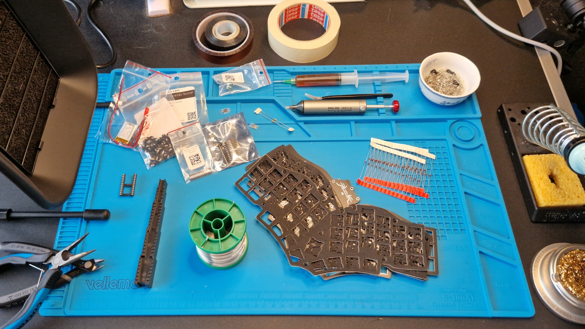

This guide documents the building process of Choctopus44v2 with THD diodes and capacitors, hotswap sockets, and an encoder.

## PCB inspection

Before starting the assembly process I recommend quickly inspecting the PCB for any defects.
The vias in the battery and Vcc traces are bigger than other vias on the board.
This can cause the solder mask to seep into it during fabrication leaving the via exposed and conductive on the surface,
especially if using JLCPCB's tented option for via covering. This is something to be addressed in the next version of the board.

Should you encounter a via like that I recommend covering the via with something non-conductive,
e.g. Kapton tape, as is done in the image in the *Battery* section.

## Diodes

Regardless of the type of diodes it's recommended that diodes are mounted on the bottom side of the PCB. In fact, if you're building be
board with case foams mounting the diodes on the bottom side of the PCB is required.
Be mindful of the orientation of the diodes, especially of the encoder diode and the two four-diode clusters.

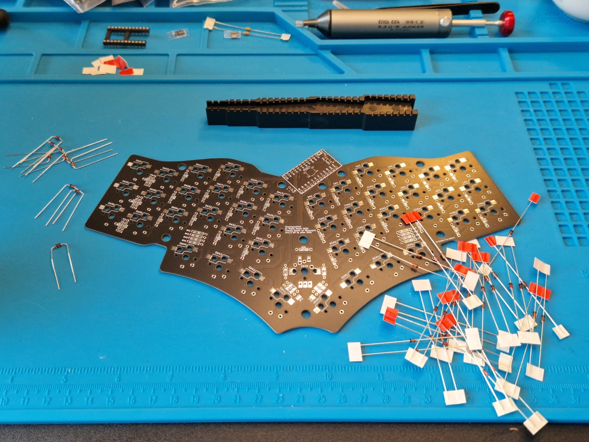

Here in the guide I'm using a PCB holder which enables me to solder the THD diodes from the "bottom" side without bending any legs.
It's not necessary to use one but I find it less cumbersome.

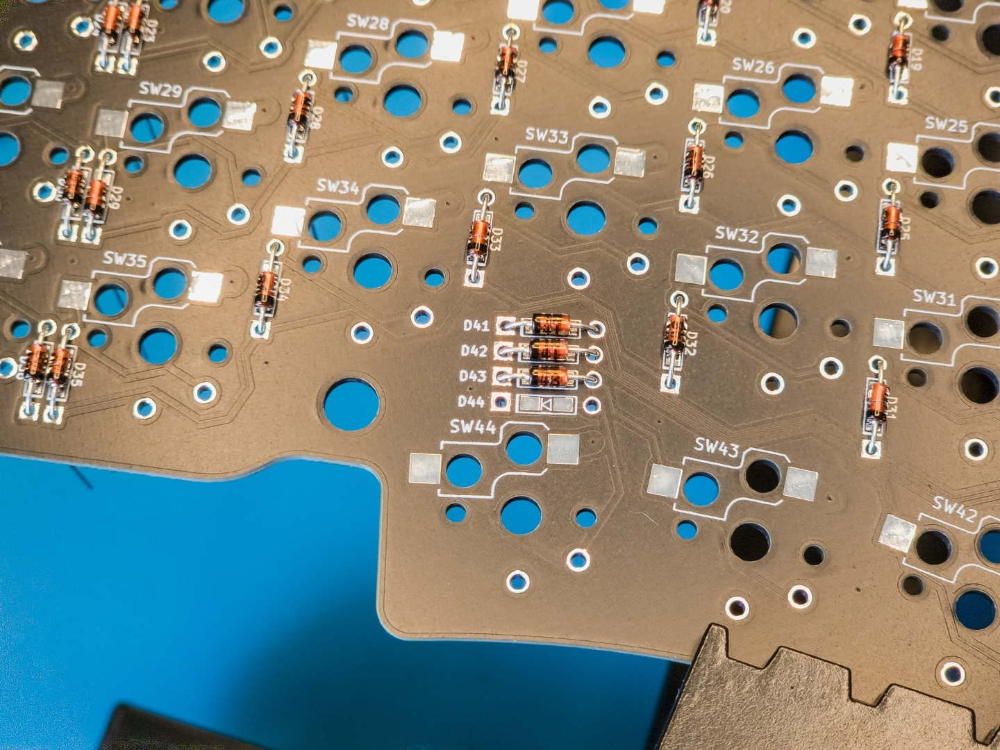

After soldering the diodes, cut the diode legs. It's recommended to cut the legs as flush as possible especially if using a plate foam.

## Encoder jumpers and capacitors

If you plan on using an encoder in your build it's recommended that you bridge the encoder filter jumpers **JP1** and **JP2** instead of using the full
encoder filter circuit. In testing I noticed that ZMK/Nice!Nano doesn't seem to like the resistors that the full filter circuit would utilize.
Please refer to **[encoder documentation](encoder.md)** for further details.

### Jumpers

The jumpers can be drag soldered rather easily by just applying a small blob of solder to the tip of your soldering iron and dragging it from
one jumper pad to another. Your mileage may wary depending on your soldering iron and soldering wire. Please keep in mind that the jumper pads
seem to be a bit more heat sensitive than one might expect, I've managed to boil one jumper pad off before noticing that drag soldering seems
to work the best for them. Should you manage to do the same you can work around the issue by using a bent diode leg or a small piece of wire to
bridge **R3** resistor footprint for jumper **JP1**, and **R2** for jumper **JP2**. ***DO NOT*** bridge resistors **R1** or **R4**.

### Capacitors (optional)

Especially if using cheap and noisy knock-off encoders the encoder output can occassionally be messy, leading to missed or double actuations when rotating it.
If that's a concern I recommend soldering on the capacitors **C1** and **C2** to the encoder filtering circuit. Even if it's not a concern it's easy enough to
solder them along with the jumpers, they do not seems to have any downsides.

The capacitors are soldered in the same way as the diodes. The capacitors used here don't have a polarity, so you don't have to worry about the orientation that they're installed.

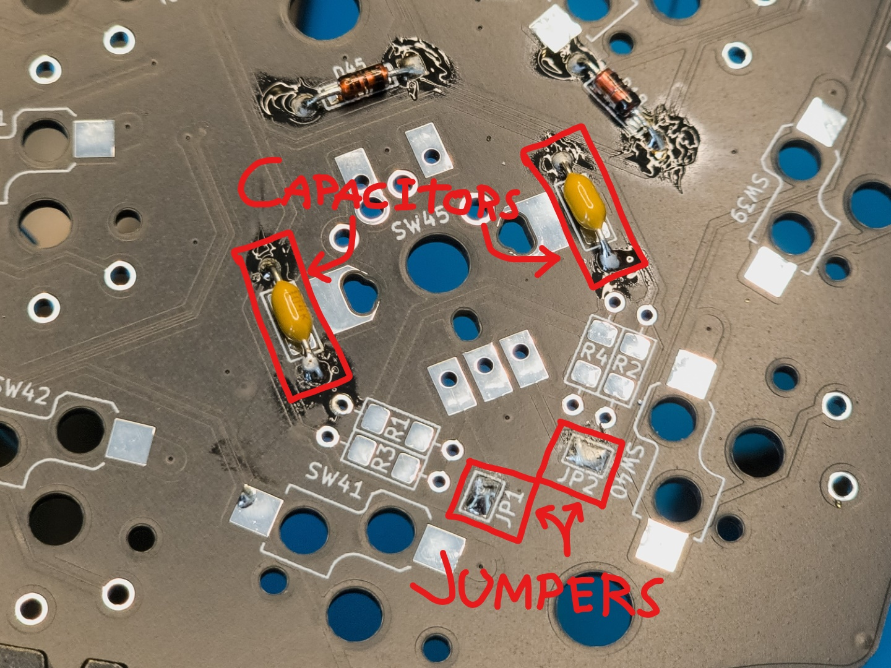

### Resistors (**not recommended!**)

It is possible to forgo bridging the jumpers and solder on the resistors of the encoder filter circuit as well.
This is not recommended and may cause the encoder to stop giving reliable output. See **[encoder documentation](encoder.md)** for further details.

## Hotswap sockets

This step is only necessary when building the board in hotswap configufation.

My preferred method of soldering hotswap sockets is to
  - First apply solder on one of the socket's pads
  - Then put the socket on top of the tinned pad
  - Reflow the tinned pad while pushing down on the socket with something
  - Appy solder to the other end of the socket
  - Finally apply more solder on the first pad if deemed necessary

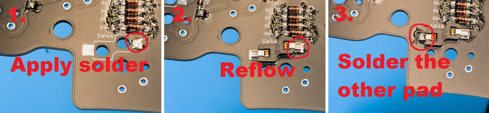

## Reset switch

Reset switch is a bit trickier to solder than the hotswap sockets, but is not too dissimilar of a process.
  - First apply solder to one of the reset switch pads
  - Hold the reset switch with tweezers and reflow the tinned pad so that one of the reset switch legs gets soldered
  - Apply solder to the rest of the legs

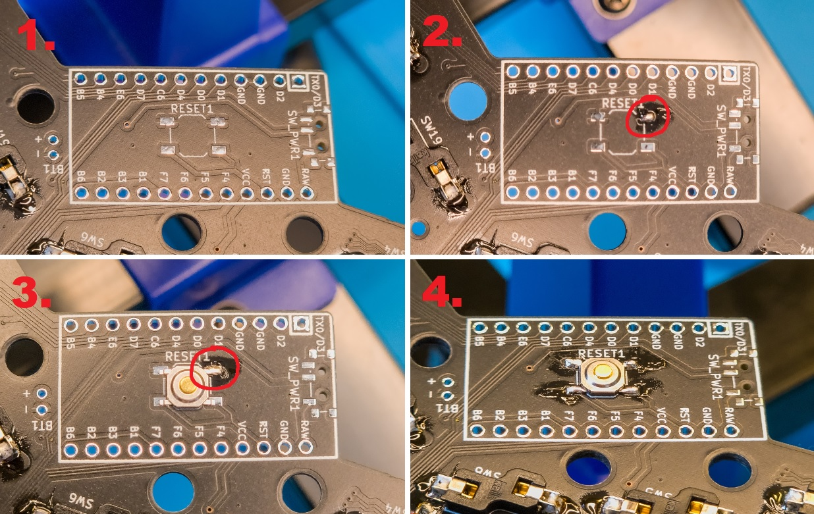

## Power switch (optional)

This step is only necessary if building a battery powered unit. The process is very similar to the reset switch step, only slightly trickier.

For the small powered pins it might be helpful to apply a small blob of solder to the tip of your iron and just dab that on the pin,
instead of trying cram both the soldering wire and the solderin iron into a small working area.

  - First apply solder to one of the power switch pads
  - Hold the power switch with tweezers and reflow the tinned pad so that one of the reset switch legs gets soldered
  - Apply solder to the rest of the legs

After soldering the switch make sure that none of the three powered pins are shorted to the side support legs or each other.

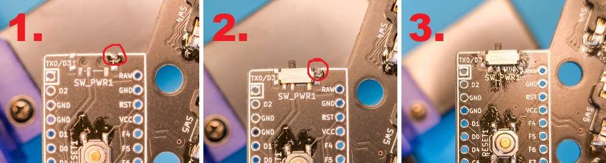

## MCU socket / MCU

After soldering all the components on the bottom side of the PCB it's sensible to start soldering components of the top side of the PCB.
In my opinion it's best to start this with the MCU socket or the MCU as that's the slimmest top side component. If you're using a socket
it's convenient to use tape to keep it in place while soldering.

If you're soldering the MCU directly onto the PCB it might make sense to actually solder the battery leads into place before the MCU.
That way it's easier get the battery leads tucked neatly under the microcontroller.

Whether you're socketing or soldering the microcontroller **it is crucial that the controller is installed smooth side up!**

Especially if you're not socketing the microcontroller it's probably the most convenient to flash the controller before soldering it into place.

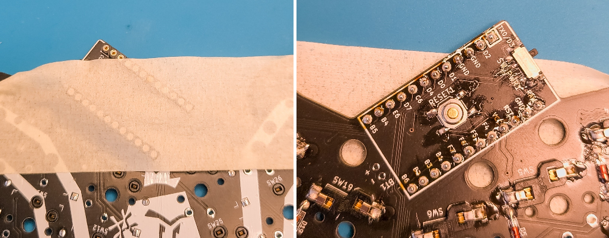

## Encoder

If you're building the board with an encoder I recommend soldering it into place before putting in the switches.
If you're using a switch in the center position instead solder that into place when installing switches.

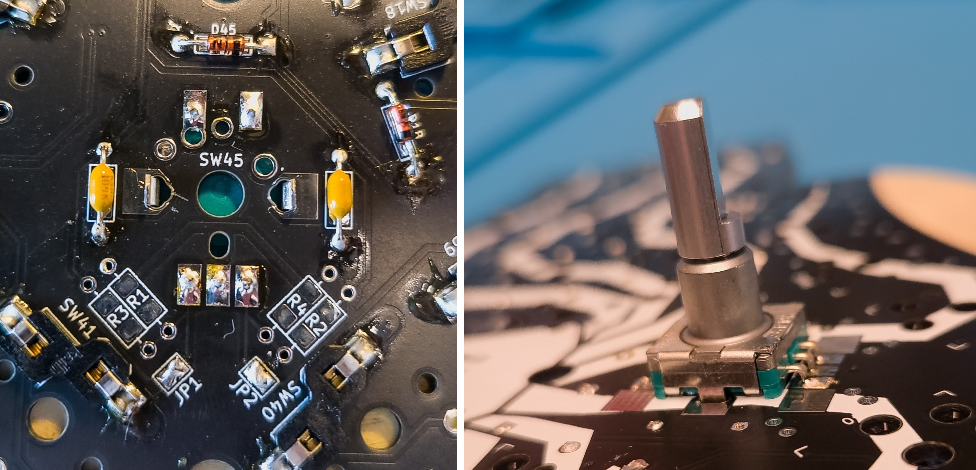

If you're using an SMD encoder or an encoder with an unusually large body it might be necessary to file the edges of the encoder cut out in the switch plate.
Please take proper safety cautions when doing so, FR4 dust is not good for your lungs. Additionally, with SMD encoders the curled side support legs have to be rolled flat.
Please refer to **[encoder documentation](encoder.md)** for further details.

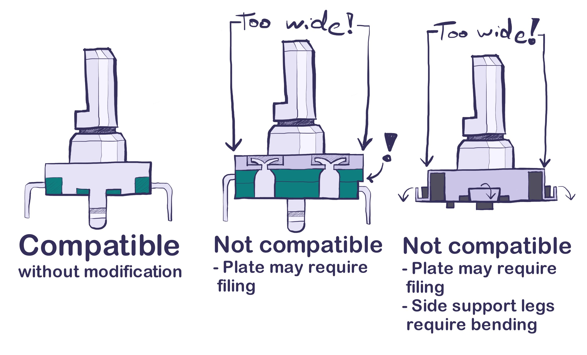

## Battery (optional)

If you're using a battery with your build it's possible to solder it to the PCB's battery pins instead of the MCU's own battery pins. This can make the build look a lot cleaner.

Depending on how long your battery leads are you might need to shorten them for a cleaner fit. Optimally you should be able to fit the loose battery leads under the microcontroller.

You should choose a battery that's small enough to fit under the MCU cover neatly.
It can be helpful to add a small piece of double sided tape between it and the MCU so that it sits securely and doesn't wobble.

***Notes!***
  1. Be mindful of the battery polarity! Incorrect polarity might damage your device
  2. I recommend having the power switch in the "off" position (top position) when soldering in the battery. That prevents the circuit of being properly powered while soldering.
  3. Try to not short the battery pins. The battery pins are a bit closer than might be convenient.
     I managed to get a small spark when soldering in the battery during the documentation build,
     which thankfully didn't break anything, but is nonetheless something that one should pay attention to.

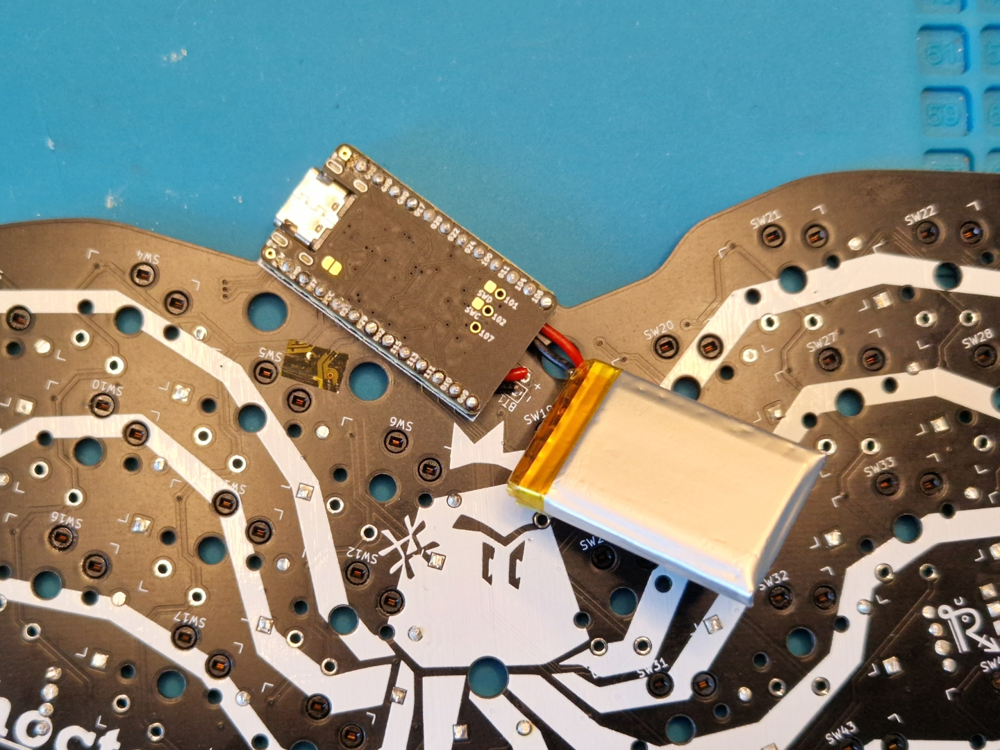

## Switches

Break the MCU cover off of the switch plate. The small "bridges" attaches to the mouse bites might be a bit difficult to remove by hand, if you have trouble with those I'd recommend
gripping them with pliers for better leverage. The tolerance between the switch plate and the MCU is pretty tight, depending on your MCU and its headers/socket you might have
to file the broken off mouse bites just a little bit if you have clearance issues. Please take proper safety cautions when doing so, FR4 dust is not good for your lungs.

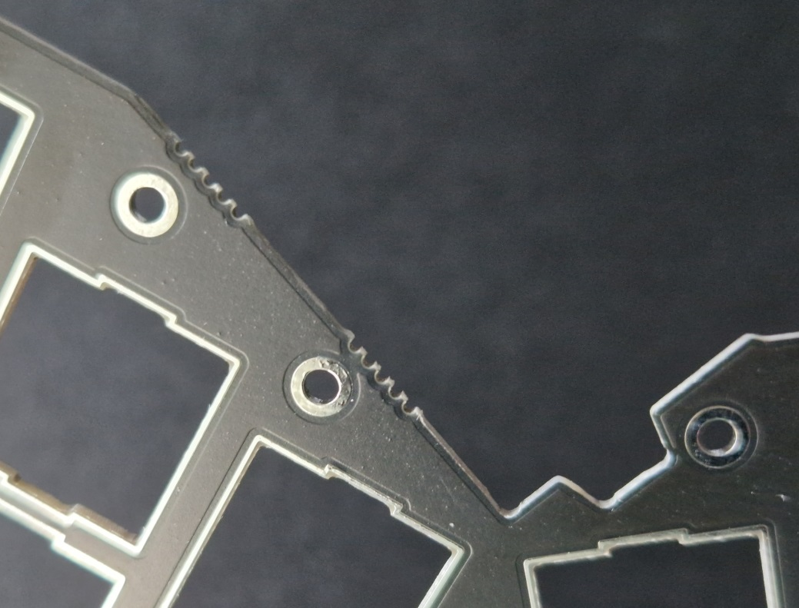

If you're using a plate foam, install it as a part of this phase. If you're using a battery it might be necessary to trim the foam just a bit
near the battery pads to make more room for the battery cables depending on your configuration.
Additionally, if you have an adhesive plate foam and plan to use it without gluing it into place I would recommend trimming the edges of the backing paper so they don't stick out as much.

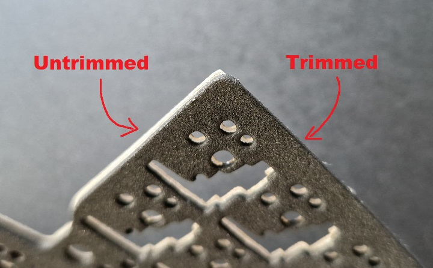

### Hotswap

Install the switches into the plate/PCB stack one by one. Be mindful of not using too much force so you don't damage the switches or worse, the switch sockets.

### Solder

Install the switches into the switch plate, and solder them into place.

## Physical assembly

Install 6 5mm stand offs on the top side of the bottom plate using 3mm screws. Install 3 other 5mm stand offs for the MCU cover positions using 10mm screws.
After the stand offs, install the bottom foam if you have one. Same as with the plate foam, if you have an adhesive bottom foam and plan to use it without
gluing it into place I would recommend trimming the edges of the backing paper so they don't stick out as much.

Install the PCB/plate assembly on top of the bottom plate using 6 3mm screws in the main positions.

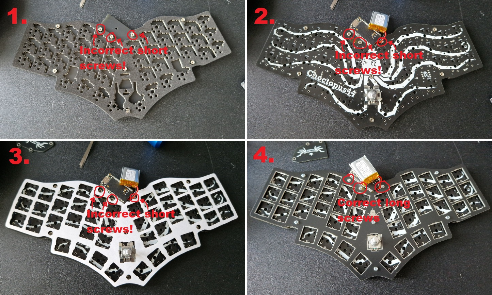

Install 10mm stand offs on the MCU cover screw bits pointing through the switch plate. After that install the MCU cover using 3mm screws.

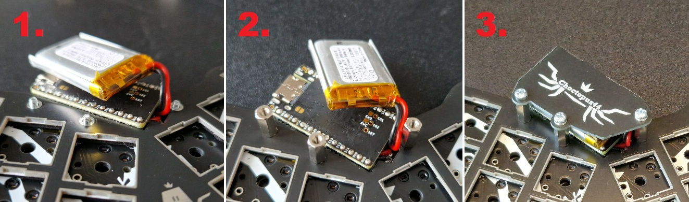

Install bump ons on the bottom of the keyboard.

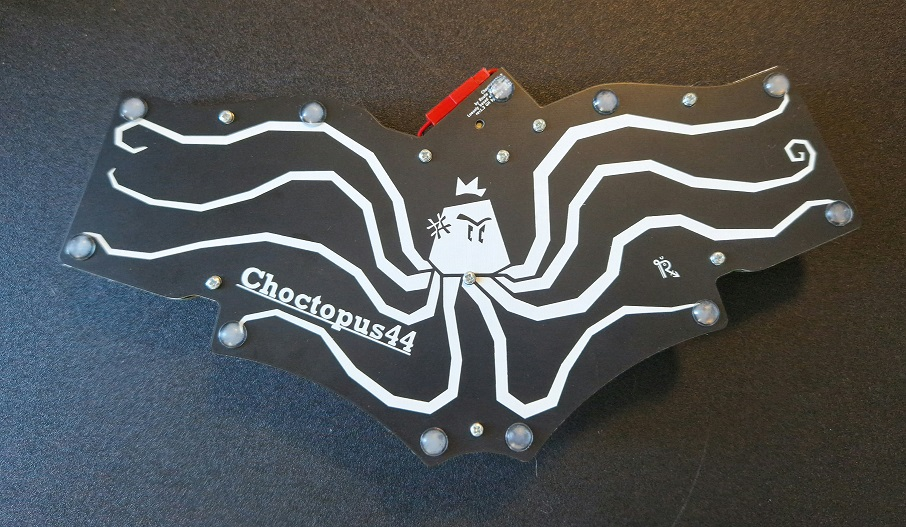

