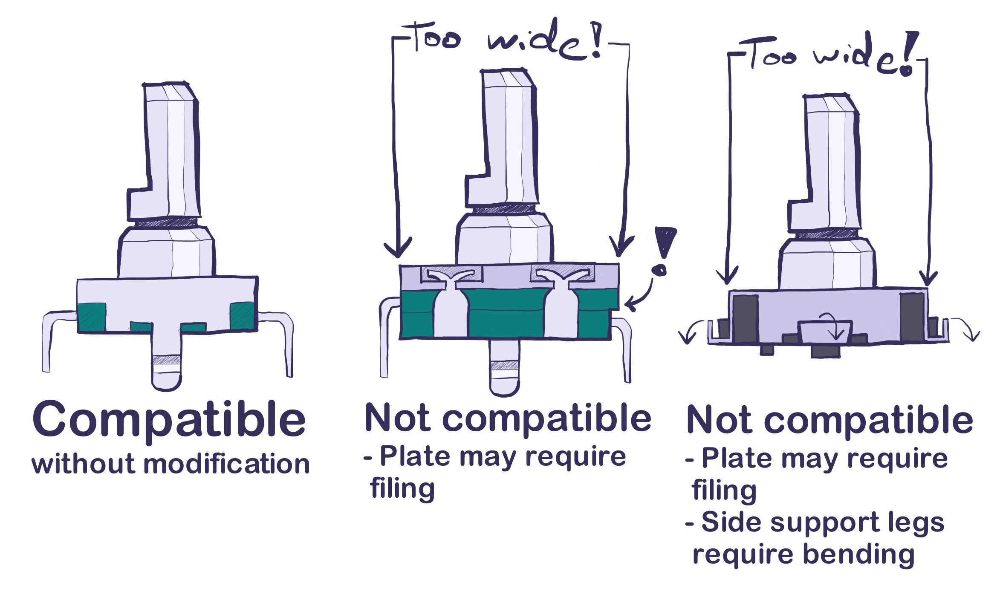

# Encoder footprint

## Compatibility

The center encoder footprint in the Choctopus is compatible with EC11 style encoders (both SMD and THD), MX type switches, and Choc switches.
However, certain encoder versions might have issues with the encoder cut out in the switch plate. For example, many SMD encoders and certain THD encoders
with large bodies may not fit the plate cut out properly requiring you to file the plate cut out a bit.
SMD encoders also require you to flatten out the side support legs so that they do not conflict with the switch plate.
Should you do so, please take proper safety percautions, as breathing in FR4 dust is not recommended.

The plan is to slightly adjust the encoder cut out size in version 2.0.1 to properly accomodate large body encoders. However, even after that SMD encoder
side support legs will still require bending.

Largest compatible encoder knob radius is 15mm, though personally I'd recommend going a good bit smaller than that for greater comfort.
However, this is very much down to encoder choise and preference, heavy encoders might be much easier to use with bigger knobs, but lighter ones might be
inconveniently easy to actuate with a large knob.

## Filtering circuit

The encoder footprint is attached to a encoder filtering circuit.
This is intended to improve performance and reliability with lower quality encoders which are not that uncommon.
However, after some very minor testing while building an unit or two it looks like the filtering circuit is largely useless, or even downright harmful for the user experience.
At least based on my testing it looks like ZMK and Nice!Nano do not play nicely with the filtering circuit in it's full configuration,
and that the resistors of the full filter circuit essentially end up disabling it as a whole.
Could be that this is entirely dependant on the values used for the circuit, but at least with 10 kOhm resistors and 100 nF capacitors I had no luck.

In normal operation I would highly recommend just bridging the jumpers that circumvent the filter circuit entirely.
However, based on some rudimentary testing, soldering the capacitors into place may still increase the reliability of the encoder.
At least in my personal board soldering those on seemed to increase the reliability of the encoder from roughly ~95% to ~100%.
