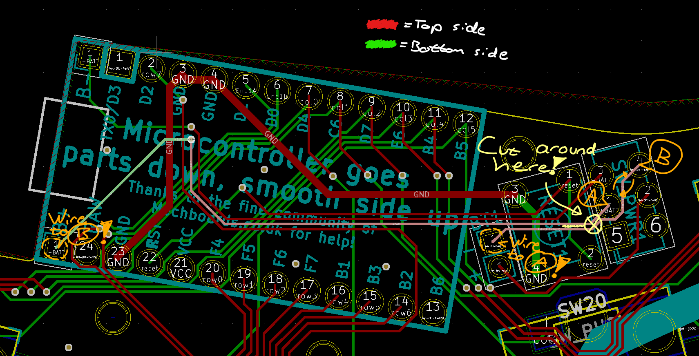
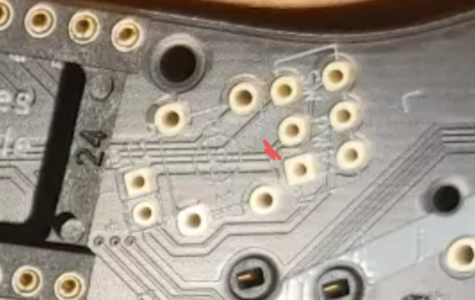

# Choctopus44 Prototype - Slide Switch Handwiring Guide

Due to a mistake I made while reading data sheets two of the battery traces are arranged wrong. This can be rectified with fairly simple handwiring, and should not be present in future revisions.

## 1. Overview

The main issue is that the traces for pads 1 and 4 of the slide switch are the wrong way about. Fixing this requires cutting two traces, and handwiring them appropriately.

## 2. Cutting taces

Cut the two traces around here on the top side of the PCB.

## 3. Handwiring

Hand wire the cut traces with the appropriate arrangement

